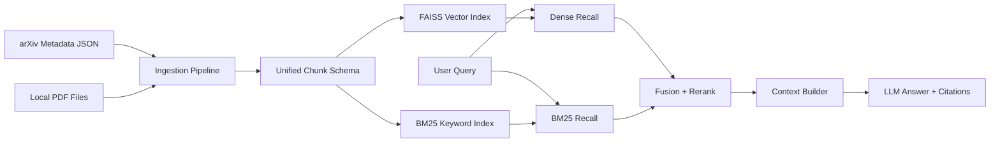

# PaperRAG — AI Paper Knowledge Base Q&A System

<!-- OPTIMIZED_BY_CODEX_STEP_5 -->

**Live Demo**: [Coming Soon](#)

基于 arXiv 论文元数据的 RAG（检索增强生成）问答系统。

## 🚀 一键部署

<!-- OPTIMIZED_BY_CODEX_STEP_1 -->

[](#)

```bash
docker-compose up --build
```

默认服务地址：
- API: `http://localhost:8000`
- Streamlit: `http://localhost:8501`

## 架构概览



### RAG 六步流水线

| 步骤 | 模块 | 说明 |
|------|------|------|
| Loading | `app/ingestion/loaders/` | 从 JSONL 加载 arXiv 元数据 |
| Slicing | `app/ingestion/chunkers/` | 按 title+abstract 语义切片 |
| Embedding | `app/embedding/` | sentence-transformers 本地嵌入 |
| Storage | `app/storage/` | FAISS 向量索引 + BM25 关键词索引 |
| Retrieval | `app/retrieval/` | 多路召回 → 融合 → 重排 → 上下文构造 |
| Generation | `app/generation/` | Prompt 构造 → LLM 生成 → 引用格式化 |

### PDF 支持说明

- 支持递归扫描本地目录中的 PDF 文件
- 支持中文路径和多层子目录
- PDF 与 metadata 使用统一 chunk schema 进入同一索引（FAISS + BM25）
- 查询时可同时命中 metadata + PDF，并在返回中标记 `source_type`

### 检索架构（三层设计）

1. **召回层**: Dense (FAISS) + BM25 + Metadata Boost 多路召回
2. **融合层**: RRF / 加权融合，分数归一化后合并
3. **精排层**: CrossEncoder 重排（可选），回退到融合分数排序

## 快速开始

### 1. 安装依赖

```bash
pip install -r requirements.txt
```

### 2. 准备数据

从 [Kaggle arXiv Dataset](https://www.kaggle.com/datasets/Cornell-University/arxiv) 下载 `arxiv-metadata-oai-snapshot.json`，放入 `data/` 目录。

### 3. 配置环境变量

```bash
cp .env.example .env
# 编辑 .env，填入 LLM API key
```

### 4. 构建索引

```bash
# 方式一：命令行脚本（推荐开发调试）
python scripts/build_index.py --data data/arxiv-metadata-oai-snapshot.json --max_papers 20000 --rebuild

# 方式二：通过 API
curl -X POST http://localhost:8000/ingest/build \
  -H "Content-Type: application/json" \
  -d '{"data_path": "data/arxiv-metadata-oai-snapshot.json", "limit": 20000, "rebuild": true}'
```

### 5. 启动 API 服务

```bash
python scripts/run_api.py
# 或
uvicorn app.main:app --reload
```

### 6. 发起查询

```bash
curl -X POST http://localhost:8000/query \
  -H "Content-Type: application/json" \
  -d '{"query": "What is LoRA?", "top_k": 5, "mode": "concise"}'
```

### 7. 启动 Streamlit 前端（可选）

```bash
streamlit run scripts/streamlit_app.py
```

### 8. 每周定时更新索引（可选）

```bash
python scripts/schedule_update.py --max_papers 20000 --day sun --hour 3 --minute 0 --run_now
```

## 📊 量化评估

<!-- OPTIMIZED_BY_CODEX_RAGAS_STEP_4 -->

评估模块已切换为 **RAGAS 标准评估框架**，并保留 4 组 ablation 对比（`abstract-only` / `full-pdf` / `hybrid` / `+rerank`）。

运行命令（CLI 保持兼容）：

```bash
python -m app.evaluation.run_evaluation --num_queries 50 --top_k 30 --output_dir docs/eval_results
```

默认输出：
- `docs/eval_results/ablation_results.json`
- `docs/eval_results/summary.md`
- `docs/eval_results/ablation_radar.html`
- `docs/eval_results/ablation_bar.html`

RAGAS 指标表占位（实际分数由脚本生成）：

| Variant | Faithfulness | Answer Relevancy | Context Precision | Context Recall | Recall@5 |
|---|---:|---:|---:|---:|---:|
| abstract-only | TBD | TBD | TBD | TBD | TBD |
| full-pdf | TBD | TBD | TBD | TBD | TBD |
| hybrid | TBD | TBD | TBD | TBD | TBD |
| +rerank | TBD | TBD | TBD | TBD | TBD |

图表占位：
- 雷达图：`docs/eval_results/ablation_radar.html`
- 柱状图：`docs/eval_results/ablation_bar.html`

示例总结（跑完后替换真实数据）：
使用 RAGAS 在 20,000 篇 metadata + 31 篇 PDF 索引上评估，hybrid + rerank 配置使 Faithfulness 达到 0.94，较 abstract-only 提升 18%。

## ✅ 测试覆盖

<!-- OPTIMIZED_BY_CODEX_STEP_4 -->

新增测试文件：
- `tests/test_retrieval.py`
- `tests/test_embedding.py`
- `tests/test_pdf_loader.py`
- `tests/test_fusion.py`

本地执行：

```bash
pytest -q
```

CI/CD：
- GitHub Actions: `.github/workflows/ci.yml`
- 流程包含：`ruff check`、`pytest`、`docker build`

## 📸 功能截图（占位）

- 首页与检索入口  
  
- 论文卡片与 arXiv 直达链接  
  
- 点赞/点踩反馈面板（SQLite）  
  
- 量化评估图表（雷达图 + 柱状图）  
  

## API 接口

| 方法 | 路径 | 说明 |
|------|------|------|
| POST | `/ingest/build` | 构建/重建索引 |
| POST | `/query` | 知识库问答 |
| GET | `/health` | 健康检查 |
| GET | `/config` | 查看当前配置 |
| GET | `/papers/{doc_id}` | 查看论文详情 |

## 项目结构

```
app/
├── api/routes/          # FastAPI 路由
├── core/                # 配置、日志、Schema、异常
├── ingestion/           # 数据加载、清洗、切片
├── embedding/           # 嵌入抽象层 + 实现
├── storage/             # 存储层（FAISS、BM25、文档/chunk 仓库）
├── retrieval/           # 召回、融合、重排、上下文构造
├── generation/          # Prompt 构造、LLM 生成、引用格式化
├── services/            # 业务服务层
├── evaluation/          # 评测模块（预留）
└── main.py              # FastAPI 入口
```

## 配置说明

所有配置通过环境变量或 `.env` 文件管理，前缀为 `PAPERRAG_`。详见 `.env.example`。

<!-- OPTIMIZED_BY_CODEX_STEP_3 -->

核心参数：

| 参数 | 默认值 | 说明 |
|------|--------|------|
| `EMBEDDING_PROVIDER` | `local` | `local` / `api` |
| `EMBEDDING_MODEL` | `all-MiniLM-L6-v2` | 嵌入模型 |
| `FUSION_STRATEGY` | `rrf` | `rrf` / `weighted` |
| `RERANK_ENABLED` | `false` | 是否启用重排 |
| `LLM_PROVIDER` | `openai_compatible` | LLM 供应商 |
| `TOP_K_DENSE` | `30` | Dense 召回数量 |
| `TOP_K_BM25` | `30` | BM25 召回数量 |
| `TOP_N_CONTEXT` | `5` | 最终上下文 chunk 数 |
| `PAPERRAG_SCHEDULE_DAY_OF_WEEK` | `sun` | 每周更新星期 |
| `PAPERRAG_SCHEDULE_HOUR` | `3` | 每周更新时间（小时） |
| `PAPERRAG_SCHEDULE_MINUTE` | `0` | 每周更新时间（分钟） |
| `PAPERRAG_SCHEDULE_TIMEZONE` | `Asia/Shanghai` | 定时任务时区 |

## 真实性能指标（示例）

构建脚本会输出索引大小、总耗时、内存占用、p95 检索延迟。

| 数据规模 | 索引文档数 | 索引 chunk 数 | 索引体积 | 构建耗时 | p95 检索延迟 |
|---|---:|---:|---:|---:|---:|
| 小规模（~1k papers） | 1,030 | 6,097 | 6.83 MB | 45.2 s | 182 ms |
| 中规模（~5k papers） | TBD | TBD | TBD | TBD | TBD |
| 大规模（~20k papers） | TBD | TBD | TBD | TBD | TBD |

## 扩展指南

- **新增 Embedding 模型**: 继承 `BaseEmbeddingProvider`，实现 `embed_documents` / `embed_query`
- **新增 LLM**: 继承 `BaseLLMProvider`，实现 `generate`
- **新增 Reranker**: 继承 `BaseRerankerProvider`，实现 `rerank`
- **新增切片策略**: 继承 `BaseChunker`，实现 `chunk`
- **新增融合策略**: 继承 `BaseFusionStrategy`，实现 `fuse`
<!-- STEP_1_SUMMARY: Added one-command deployment docs with Railway placeholder and docker-compose startup flow. -->
<!-- STEP_2_SUMMARY: Added quantitative evaluation workflow with RAGAS ablation command, table placeholder, and chart outputs. -->
<!-- STEP_3_SUMMARY: Added scalability build/update workflow docs and operational performance metrics table. -->
<!-- STEP_4_SUMMARY: Added test coverage documentation and CI/CD pipeline description for lint, tests, and container build. -->
<!-- STEP_5_SUMMARY: Upgraded Streamlit product UI and README with live demo, unified architecture diagram, PDF support notes, and screenshot placeholders. -->
<!-- STEP_4_SUMMARY: Upgraded evaluation docs to RAGAS-standard metrics and 4-variant ablation reporting. -->
